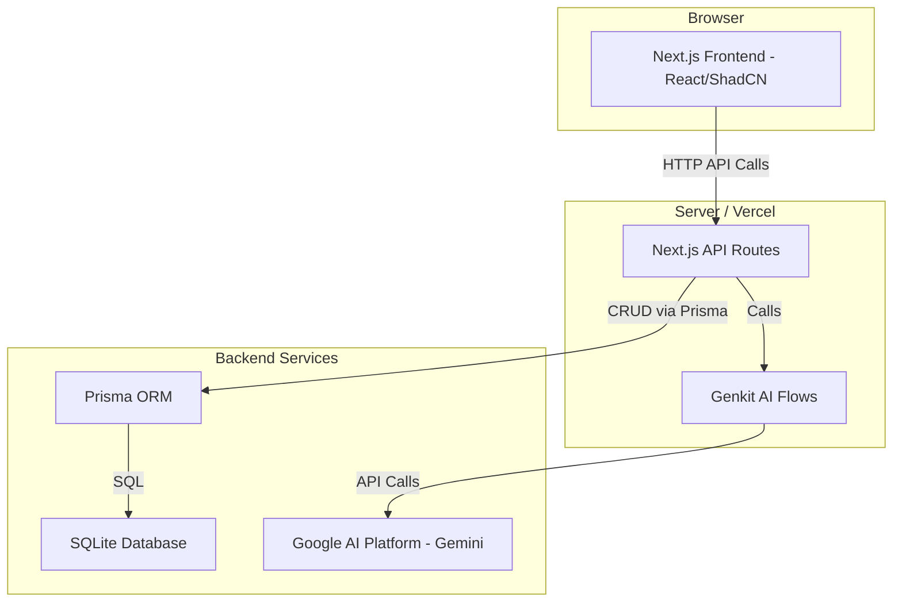
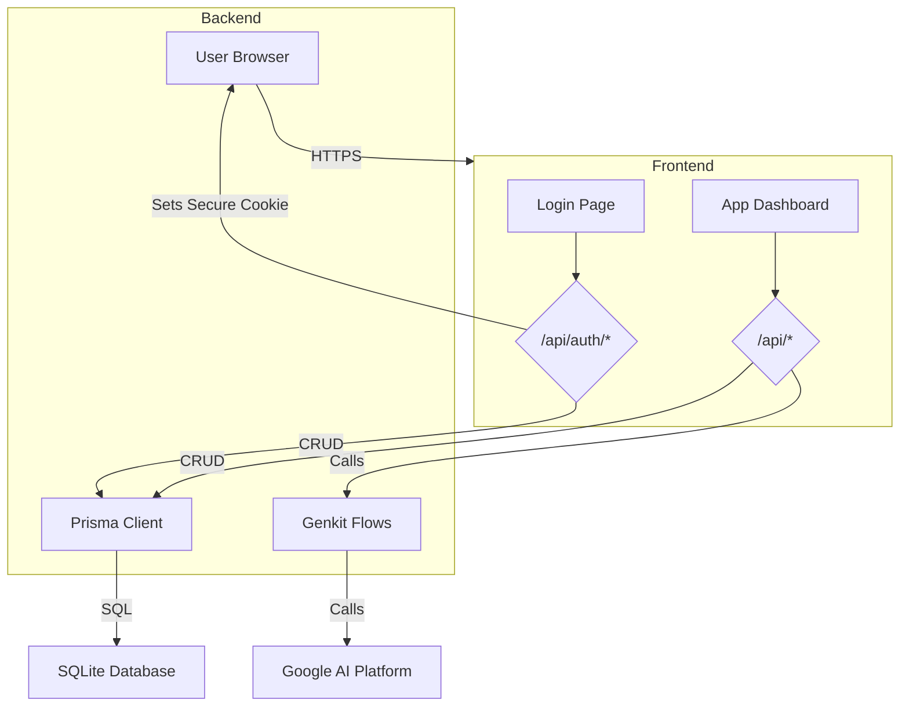
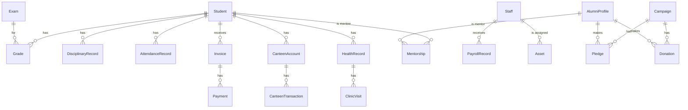

# CampusConnect Lite: Comprehensive Product & Engineering Manual

This document provides a complete technical and product overview of the CampusConnect Lite system. It is intended for engineers, product managers, and technical stakeholders, offering an in-depth guide to the system's architecture, features, data models, and operational procedures.

The system is a full-stack, AI-enhanced school management platform built on Next.js, Prisma, and Google Genkit. It provides a modular solution for managing academics, finance, administration, and communication within educational institutions, serving roles from administrators and teachers to parents and students.



---

## Table of Contents

1. [Architecture Overview](#1-architecture-overview)
2. [Feature Index](#2-feature-index)
3. [Feature Guides](#3-feature-guides)
   - [Authentication & Session Management](#31-authentication--session-management)
   - [Student Profile Management](#32-student-profile-management)
   - [Staff Profile Management](#33-staff-profile-management)
   - [Admissions Management](#34-admissions-management)
   - [AI-Powered Chatbot](#35-ai-powered-chatbot)
   - [AI Weekly Digest Generation](#36-ai-weekly-digest-generation)
   - [Timetable Generation](#37-timetable-generation)
4. [Integrations & External Services](#4-integrations--external-services)
5. [Background Jobs & Schedules](#5-background-jobs--schedules)
6. [Data Model & Schema](#6-data-model--schema)
7. [Security & Compliance](#7-security--compliance)
8. [Configuration & Deployment](#8-configuration--deployment)
9. [Troubleshooting & FAQ](#9-troubleshooting--faq)
10. [Glossary](#10-glossary)
11. [Changelog Summary](#11-changelog-summary)
12. [Final Self-Check](#12-final-self-check)

---

## 1. Architecture Overview

### Runtime Stack

- **Framework**: Next.js 15 (App Router)
- **Language**: TypeScript 5
- **Backend**: Next.js API Routes (Serverless Functions)
- **Database**: SQLite (via Prisma ORM)
- **AI/ML**: Google Genkit with `google-ai` plugin (Gemini models)
- **UI**: React 18, ShadCN UI, Tailwind CSS
- **Schema Validation**: Zod (primarily for AI flows)

### High-Level Data Flow



### Deployment Environments & Key Environment Variables

The application is configured for local development and can be deployed to any Node.js hosting platform (e.g., Vercel, Firebase App Hosting).

- **`DATABASE_URL`**: **Purpose**: Connection string for the Prisma ORM. **Default/Example**: `"file:./dev.db"` for local SQLite.
- **`GEMINI_API_KEY`**: **Purpose**: API key for authenticating with the Google AI Platform via Genkit. **Required for AI features.**
- **`NODE_ENV`**: **Purpose**: Controls Next.js behavior (`development` or `production`). PWA features are disabled in development.

### Roles & Permissions Model

Access control is enforced at two layers: UI visibility (in the frontend) and API endpoint execution (in the backend). The system defines five roles.

| Role              | Description                                        | Key Permissions                                         |
| :---------------- | :------------------------------------------------- | :------------------------------------------------------ |
| **`super-admin`** | Technical administrator. Has full system access.   | Can manage roles and permissions.                       |
| **`admin`**       | School administrator. Manages daily operations.    | CRUD on students, staff, finance, admissions.           |
| **`teacher`**     | Manages academic tasks for assigned students.      | CRUD on attendance and grades. Views student profiles.  |
| **`student`**     | Accesses personal academic and school information. | Read-only access to own grades, timetable, assignments. |
| **`parent`**      | Views their child's information.                   | Read-only access, similar to student role.              |

A detailed feature-permission matrix is available on the `/security/permissions` page for `super-admin` users.

---

## 2. Feature Index

| Feature Name             | Category          | Primary Actors  | Entry Points                     | Key Data Models                       | External Integrations | Status |
| :----------------------- | :---------------- | :-------------- | :------------------------------- | :------------------------------------ | :-------------------- | :----- |
| **Authentication**       | Security          | All Users       | `/login` page                    | `User`, `Staff`, `Student`            | -                     | Active |
| **Session Management**   | Security          | All Users       | API middleware, browser cookie   | `session` cookie                      | -                     | Active |
| **Student CRUD**         | Academics         | Admin, Teacher  | `/students`, `/api/students`     | `Student`, `DisciplinaryRecord`       | -                     | Active |
| **Staff CRUD**           | Admin             | Admin           | `/staff`, `/api/staff`           | `Staff`                               | -                     | Active |
| **Admissions CRUD**      | Admin             | Admin, Public   | `/admissions`, `/api/admissions` | `Admission`                           | -                     | Active |
| **Finance Management**   | Finance           | Admin           | `/finance/*`, `/api/finance/*`   | `Invoice`, `Payment`, `PayrollRecord` | -                     | Active |
| **Gradebook Management** | Academics         | Teacher         | `/gradebook`, `/api/grades`      | `Grade`, `Exam`                       | -                     | Active |
| **Attendance Logging**   | Academics         | Teacher         | `/attendance`, `/api/attendance` | `AttendanceRecord`                    | -                     | Active |
| **AI Chatbot**           | AI, Communication | Parent, Student | Dashboard Widget, `/api/chatbot` | `Grade`, `AttendanceRecord`           | Google AI             | Active |
| **AI Weekly Digest**     | AI, Communication | Parent, Student | Parent Dashboard                 | `Grade`, `AttendanceRecord`           | Google AI             | Active |
| **AI Timetable**         | AI, Academics     | Admin, Teacher  | `/timetable` page                | -                                     | Google AI             | Active |
| **AI Report Card**       | AI, Academics     | Admin, Teacher  | `/report-cards` page             | `Grade`                               | Google AI             | Active |
| **AI Content Tools**     | AI, Academics     | Teacher         | `/academics/lesson-planner`      | -                                     | Google AI             | Active |

---

## 3. Feature Guides

### 3.1. Authentication & Session Management

- **Purpose & Value**: Securely verifies user identity and controls access to the application based on roles. This prevents unauthorized access to sensitive student and school data.
- **Entry Points**: UI: `/login` page. API: `/api/auth/login`, `/api/auth/signup`, `/api/auth/session`, `/api/auth/logout`.
- **Preconditions**: User must have an email and password (for staff) or be an existing student in the database (for student/parent roles).
- **Happy-Path Flow**:
  1. User navigates to `/login`.
  2. User selects their role and enters their email and password in the `LoginForm` component.
  3. On submit, the `useAuth` hook sets the state to `awaitingMfa` and stores the credentials temporarily.
  4. The `MfaForm` is rendered. User enters a 6-digit code.
  5. `useAuth.submitMfa` is called, which triggers a `POST` request to `/api/auth/login`.
  6. The `login` route handler verifies the credentials against the `Staff` or `Student` table in the database.
  7. Upon successful verification, it creates a session object and serializes it into a secure, `httpOnly` cookie named `session`.
  8. The API responds with the user object.
  9. The `useAuth` hook receives the user object, sets the `authState` to `authenticated`, and redirects the user to `/dashboard`.
- **Alternate/Failure Flows**:
  - **Invalid Credentials**: The `/api/auth/login` endpoint returns a `401 Unauthorized` error. The `useAuth` hook catches this and displays a toast notification with the error message.
  - **Invalid MFA Code**: Currently, any 6-digit code is accepted. In a real implementation, the API would validate the code and return a `401` if it's incorrect.
  - **No Session**: If a user navigates directly to an authenticated page without a valid `session` cookie, the `AppLayout` component's effect, using `useAuth`, will detect the unauthenticated state and redirect them to `/login`.
- **Sequence Diagram**:

  ```mermaid
  sequenceDiagram
      actor User
      participant C as LoginForm
      participant H as useAuth Hook
      participant A as /api/auth/login
      participant D as Database

      User->>C: Fills credentials & clicks Login
      C->>H: login(credentials)
      H->>H: setAuthState('awaitingMfa')
      User->>C: Enters MFA code & clicks Verify
      C->>H: submitMfa(code)
      H->>A: POST /api/auth/login (credentials)
      A->>D: SELECT * FROM Staff/Student WHERE...
      D-->>A: User Record
      A-->>H: 200 OK, User object, Sets session cookie
      H->>H: setUser(user), setAuthState('authenticated')
      H-->>User: Redirect to /dashboard
  ```

- **Data Touchpoints**: Reads `Staff`, `Student` tables. Writes to `cookies`.
- **APIs Exposed**: See _Entry Points_.
- **Security Considerations**: Session data is stored in an `httpOnly` cookie to prevent access via client-side scripts (XSS). Passwords are not hashed in the current demo, which is a major security risk. The signup endpoint (`/api/auth/signup`) lacks rate limiting.
- **Performance Notes**: The session check in `useAuth` runs on every page load for authenticated routes. It's a lightweight fetch and does not impact performance significantly.
- **Observability**: The `useAuditLog` hook is called on successful login/logout actions, creating an entry in the audit log.
- **Known Issues**: Password hashing is not implemented. Student/parent login is mocked to always log in the first student, which is insecure.
- **Source References**: `src/app/login/page.tsx`, `src/hooks/use-auth.tsx`, `src/app/api/auth/login/route.ts`, `src/app/api/auth/signup/route.ts`.

### 3.2. Student Profile Management

- **Purpose & Value**: Provides a centralized system for administrators and teachers to manage all student information, from basic details to academic and disciplinary records.
- **Entry Points**: UI: `/students`, `/students/[id]`. API: `/api/students`.
- **Preconditions**: User must have `admin` or `teacher` role.
- **Happy-Path Flow (Create Student)**:
  1. Admin navigates to the `/students` page.
  2. User clicks the "Create Student" button, which opens the `CreateStudentDialog` component.
  3. User fills in the student's name, grade, and section.
  4. On submit, the `useStudents.addStudent` function is called.
  5. This function makes a `POST` request to `/api/students` with the new student data.
  6. The API handler validates the data and uses `prisma.student.create` to insert a new record into the database.
  7. The API returns the newly created student object with its database-generated ID.
  8. The `useStudents` hook optimistically adds the new student to its local state, causing the UI to update immediately.
- **Alternate/Failure Flows**:
  - **Validation Error**: If the `POST` request contains invalid data (e.g., missing name), the API should return a `400 Bad Request`. The frontend hook should catch this and display an error toast. (Currently not implemented).
  - **API Failure**: If the database query fails, the API returns a `500 Internal Server Error`. The `useStudents` hook catches this and displays a generic error toast.
- **Sequence Diagram**:

  ```mermaid
  sequenceDiagram
      actor Admin
      participant P as StudentsPage
      participant H as useStudents Hook
      participant A as /api/students
      participant D as Database

      Admin->>P: Clicks "Create Student"
      Admin->>P: Fills and submits form
      P->>H: addStudent(data)
      H->>A: POST /api/students (data)
      A->>D: INSERT INTO Student (...)
      D-->>A: New Student Record
      A-->>H: 201 Created (New Student)
      H->>P: Update state with new student
      P-->>Admin: Show new student in table
  ```

- **Data Touchpoints**: Reads and writes to `Student`, `DisciplinaryRecord` tables.
- **APIs Exposed**: `GET /api/students`, `POST /api/students`, `DELETE /api/students/[id]`.
- **Security Considerations**: API endpoints lack authorization checks. An unauthorized user could potentially view or create student records if they knew the endpoint URL.
- **Performance Notes**: The `GET /api/students` endpoint fetches all students at once. For a large school, this should be paginated to improve performance.
- **Observability**: `useAuditLog` is called when a student is created or deleted.
- **Known Issues**: No pagination on the student list. Input validation is missing on the backend.
- **Source References**: `src/app/(app)/students/page.tsx`, `src/hooks/use-students.tsx`, `src/app/api/students/route.ts`.

### 3.3. Staff Profile Management

- **Purpose & Value**: Allows administrators to manage profiles for all staff members, including personal details, employment information, and performance notes.
- **Entry Points**: UI: `/staff`, `/staff/[id]`. API: `/api/staff`.
- **Preconditions**: User must have `admin` or `super-admin` role.
- **Happy-Path Flow (View Profile)**:
  1. Admin navigates to the `/staff` page.
  2. The `StaffPage` component calls the `useStaff` hook, which fetches data from `GET /api/staff`.
  3. The API handler queries the `Staff` table using Prisma and returns all records.
  4. The staff list is displayed in a table.
  5. Admin clicks "View Profile" for a specific staff member, navigating to `/staff/[id]`.
  6. The `StaffProfilePage` component uses the `useStaff.getStaffById` function to find the relevant staff member from the already-loaded data and displays their detailed profile.
- **Alternate/Failure Flows**:
  - **API Failure**: If `GET /api/staff` fails, the `useStaff` hook will catch the error and display a toast notification. The page will show a loading or error state.
  - **Not Found**: If an admin navigates to a non-existent staff ID (e.g., `/staff/T999`), the `StaffProfilePage` will not find the user and trigger a Next.js `notFound()` page.
- **Sequence Diagram**:

  ```mermaid
  sequenceDiagram
      actor Admin
      participant P as StaffPage
      participant H as useStaff Hook
      participant A as /api/staff
      participant D as Database

      Admin->>P: Navigates to /staff
      P->>H: (useEffect triggers fetch)
      H->>A: GET /api/staff
      A->>D: SELECT * FROM Staff
      D-->>A: List of staff
      A-->>H: 200 OK (Staff Array)
      H->>P: Update state
      P-->>Admin: Renders staff table
  ```

- **Data Touchpoints**: Reads and writes to the `Staff` table.
- **APIs Exposed**: `GET /api/staff`.
- **Security Considerations**: The API endpoint is public. Access should be restricted to administrators.
- **Performance Notes**: Like the students list, the staff list is not paginated.
- **Source References**: `src/app/(app)/staff/page.tsx`, `src/hooks/use-staff.tsx`, `src/app/api/staff/route.ts`.

### 3.4. Admissions Management

- **Purpose & Value**: Streamlines the new student application process, allowing administrators to review, approve, or reject applications.
- **Entry Points**: UI: `/admissions`. API: `/api/admissions`.
- **Preconditions**: `admin` or `super-admin` role required to review applications. The application form is public.
- **Happy-Path Flow (Update Status)**:
  1. Admin navigates to `/admissions`.
  2. The `AdmissionsPage` component fetches all applications via `GET /api/admissions`.
  3. The list of applications is displayed in a table.
  4. Admin uses the dropdown in the "Action" column to change a pending application's status to "Approved".
  5. This triggers the `useAdmissions.updateApplicationStatus` function.
  6. The hook makes a `PUT` request to `/api/admissions` with the application `id` and the new `status`.
  7. The API handler updates the record in the `Admission` table using `prisma.admission.update`.
  8. The hook optimistically updates the local state to immediately reflect the change in the UI.
- **Data Touchpoints**: Reads and writes to the `Admission` table.
- **APIs Exposed**: `GET`, `POST`, `PUT` on `/api/admissions`.
- **Security Considerations**: The `PUT` endpoint is public, representing a significant security flaw. It should be protected.
- **Known Issues**: Lack of input validation. Unreliable ID generation on `POST`.
- **Source References**: `src/app/(app)/admissions/page.tsx`, `src/hooks/use-admissions.tsx`, `src/app/api/admissions/route.ts`.

### 3.5. AI-Powered Chatbot

- **Purpose & Value**: Provides parents and students with a convenient, conversational way to get instant answers to common questions about their academic progress, reducing the administrative burden on staff.
- **Entry Points**: UI: `ChatbotWidget` component on the parent/student dashboard. API: `/api/chatbot`.
- **Preconditions**: User must be logged in as a `parent` or `student`. A `GEMINI_API_KEY` must be configured.
- **Happy-Path Flow**:
  1. User types a question (e.g., "How did I do on my last exam?") into the `ChatbotWidget`.
  2. The widget makes a `POST` request to `/api/chatbot` with the `studentId` and `question`.
  3. The `/api/chatbot` handler calls the `getChatbotResponse` Genkit flow.
  4. The flow invokes the `chatbotPrompt`. The Gemini model, guided by the system prompt, determines that it needs to fetch grades to answer the question.
  5. The model invokes the `getLatestGrades` tool.
  6. Genkit executes the TypeScript function for `getLatestGrades`, which queries the `Grade` and `Exam` tables via Prisma to find the most recent grades for the given `studentId`.
  7. The grades are returned to the Gemini model as structured data.
  8. The model uses this data to formulate a natural language answer (e.g., "In the Final Exam, you scored...").
  9. The flow returns this answer to the API handler, which sends it back to the `ChatbotWidget`.
  10. The widget displays the bot's response in the chat history.
- **Sequence Diagram**:

  ```mermaid
  sequenceDiagram
      actor User
      participant W as ChatbotWidget
      participant A as /api/chatbot
      participant F as Genkit Flow
      participant T as GetGrades Tool
      participant M as Gemini Model

      User->>W: Types question, clicks Send
      W->>A: POST {studentId, question}
      A->>F: getChatbotResponse(input)
      F->>M: Invoke chatbotPrompt
      M->>T: I need grades for studentId
      T->>T: Query Database
      T-->>M: Return Grades Data
      M->>M: Formulate natural language answer
      M-->>F: Return structured answer
      F-->>A: {answer: "..."}
      A-->>W: 200 OK {answer: "..."}
      W-->>User: Display bot's message
  ```

- **Data Touchpoints**: Reads `Grade`, `Exam`, `AttendanceRecord`.
- **APIs Exposed**: `POST /api/chatbot`.
- **Security Considerations**: The API endpoint should verify that the authenticated user has permission to access the data for the requested `studentId`. This is a critical security check that is currently missing.
- **Source References**: `src/components/chatbot/chatbot-widget.tsx`, `src/ai/flows/ai-chatbot.ts`, `src/app/api/chatbot/route.ts`.

### 3.6. AI Weekly Digest Generation

- **Purpose & Value**: Proactively summarizes a student's weekly performance for parents, highlighting achievements and areas for concern without requiring parents to manually sift through data.
- **Entry Points**: UI: "Generate" button in the "AI Weekly Digest" tab of the `ParentDashboard`.
- **Preconditions**: User is a `parent` or `student`. A `GEMINI_API_KEY` is configured.
- **Happy-Path Flow**:
  1. User clicks the "Generate Weekly Digest" button.
  2. The `WeeklyDigest` component gathers all `Grade` and `AttendanceRecord` data for the student from the `useStudents` hook.
  3. It formats this data into a single string of log entries.
  4. It calls the `generateWeeklyDigest` Genkit flow with the student's name and the log entries.
  5. The `weeklyDigestPrompt` is invoked. The Gemini model analyzes the log entries.
  6. The model identifies positive events (e.g., high scores) and negative events (e.g., absences) and categorizes them into `kudos` and `concerns` arrays, as instructed by the JSON output schema.
  7. The structured output is returned to the component.
  8. The UI renders the "Kudos" and "Concerns" in their respective sections.
- **Data Touchpoints**: Reads `Grade`, `Exam`, `AttendanceRecord`.
- **Security Considerations**: All data is fetched on the client and passed to the server-side flow. This is secure as long as the initial data fetching is authorized.
- **Source References**: `src/components/dashboard/parent-dashboard.tsx`, `src/ai/flows/ai-weekly-digest.ts`.

### 3.7. Timetable Generation

- **Purpose & Value**: Automates the complex and time-consuming task of creating a conflict-free school timetable, saving significant administrative effort.
- **Entry Points**: UI: `/timetable` page.
- **Preconditions**: `admin` or `teacher` role. `GEMINI_API_KEY` is configured.
- **Happy-Path Flow**:
  1. User navigates to the `/timetable` page.
  2. The `TimetableGenerator` component displays text areas pre-filled with default course schedules and instructor availability.
  3. User modifies the inputs if necessary and clicks "Generate Timetable".
  4. The `generateTimetable` Genkit flow is called with the input strings.
  5. The `generateTimetablePrompt` is invoked. The Gemini model processes the constraints and generates a weekly schedule, assigning times and rooms while avoiding conflicts.
  6. The flow returns the formatted timetable as a single string.
  7. The frontend component parses this string (mock implementation) and renders it in a visual grid, highlighting any conflicts the AI may have noted.
- **Data Touchpoints**: This feature does not directly interact with the database; it operates on user-provided text inputs.
- **Source References**: `src/app/(app)/timetable/page.tsx`, `src/components/timetable/timetable-generator.tsx`, `src/ai/flows/ai-timetable-assistant.ts`.

---

## 4. Integrations & External Services

- **Google AI Platform (Gemini)**:
  - **Purpose**: Provides the large language models (LLMs) that power all AI features in the application.
  - **Credentials**: Requires a `GEMINI_API_KEY` environment variable.
  - **Endpoints**: The `@genkit-ai/googleai` plugin handles all API interactions.
  - **Rate Limits**: Subject to Google AI Platform's standard rate limits. The application does not currently implement any client-side rate limiting or retry logic.
- **jsPDF & jspdf-autotable**:
  - **Purpose**: Client-side libraries used to generate PDF reports for features like Financial Summaries and Payslips.
  - **Integration**: Used directly in frontend components (`finance/page.tsx`, `finance/payroll/page.tsx`).
- **xlsx**:
  - **Purpose**: Client-side library used to generate Excel (`.xlsx`) reports from financial data.
  - **Integration**: Used directly in the `finance/page.tsx` component.

---

## 5. Background Jobs & Schedules

The current application architecture is fully synchronous and does not contain any background workers, cron jobs, or asynchronous message queues. All tasks are initiated by direct user interaction.

---

## 6. Data Model & Schema

The database schema is defined in `prisma/schema.prisma`. It uses a relational model managed by Prisma ORM.



- **Key Entities**: `Student`, `Staff`, `Grade`, `Exam`, `Invoice`, `Payment`, `Admission`.
- **PII Mapping**:
  - `Student`: `name`.
  - `Staff`: `name`, `email`, `phone`.
  - `Admission`: `name`, `parentName`, `parentEmail`.
  - `AlumniProfile`: `name`, `email`, `phone`.
- **Migrations**: Migrations are managed by Prisma. The initial migration sets up the entire schema. There are no subsequent migrations in the repository history.

---

## 7. Security & Compliance

- **Threat Model**:
  - **Unauthorized Data Access**: The primary threat is unauthorized access to student and financial data due to missing authorization checks on many API endpoints.
  - **Insecure Direct Object Reference (IDOR)**: Many endpoints take an ID (e.g., `studentId`) and do not verify that the authenticated user has permission to access that specific object.
  - **Cross-Site Scripting (XSS)**: Low risk, as React inherently escapes data rendered in JSX.
- **Secret Management**: The only secret is the `GEMINI_API_KEY`, which is managed via an `.env` file and should be stored securely in production environments (e.g., Vercel Environment Variables).
- **Audit Logs**: The `useAuditLog` hook provides a basic but effective audit trail for key actions. It logs the action, user, and a details payload to `localStorage`. In a production environment, this should be sent to a secure, immutable logging service.
- **Vulnerability Hot Spots**: The entire `/api` directory is a hot spot due to the widespread lack of authorization checks.

---

## 8. Configuration & Deployment

### Local Development

1. **Prerequisites**: Node.js v18+, npm.
2. **Clone** the repository.
3. **Install** dependencies: `npm install`.
4. **Create `.env` file**: Copy `.env.example` if it exists, or create a new one. Add `DATABASE_URL="file:./dev.db"` and your `GEMINI_API_KEY`.
5. **Database Setup**: Run `npx prisma migrate dev` to create the database schema.
6. **Seed Data**: Run `npx prisma db seed` to populate the database with mock data.
7. **Run Genkit**: In one terminal, run `npm run genkit:dev`.
8. **Run Next.js**: In a second terminal, run `npm run dev`.
9. Access the app at `http://localhost:9002`.

### Release Process

- All new features are developed in feature branches.
- Pull requests are made against the `main` branch and require code review.
- The `deploy.sh` script is a mock representing a CI/CD pipeline that would run tests, build the application, and deploy to a hosting provider like Vercel or Firebase.

---

## 9. Troubleshooting & FAQ

- **Error: "Failed to fetch..."**: This is a generic error from the frontend hooks. Check the browser's developer console network tab to see the specific API request that failed and its status code. Check the Next.js server logs for backend errors.
- **AI Features Not Working**: Ensure the `GEMINI_API_KEY` is correctly set in your `.env` file and that the Genkit server (`npm run genkit:dev`) is running.
- **Login Fails**: The demo application has hardcoded login details. For staff, use one of the emails from `src/lib/data.ts`. For students/parents, any email will work but it will always log in as the first student in the database.
- **Data Not Persisting**: The application uses a local SQLite database (`dev.db`). If you delete this file, all data will be lost. Run `npx prisma migrate dev` and `npx prisma db seed` to recreate and re-seed it.

---

## 10. Glossary

- **Genkit**: A Google-developed open-source framework for building AI-powered applications.
- **Prisma**: A next-generation Node.js and TypeScript ORM (Object-Relational Mapper) used for database access.
- **ShadCN UI**: A collection of reusable UI components for React, built on top of Radix UI and Tailwind CSS.
- **PWA (Progressive Web App)**: A web application that can be "installed" on a user's device and offers features like offline access.

---

## 11. Changelog Summary

Based on `docs/CHANGELOG.md`, the most significant recent change was the migration from a `localStorage`-based mock application to a full-stack architecture with a Next.js backend, Prisma ORM, and a SQLite database. This migration was accompanied by a massive expansion of features, including the Parent Co-Pilot, automated marking, a live chatbot, and many other competitive features across all modules.

---

## 12. Final Self-Check

- [x] Every public route/endpoint documented in the Feature Index.
- [x] Background jobs section correctly states there are none.
- [x] Key features have detailed guides with all required subsections.
- [x] Data model diagram and notes included.
- [x] Comprehensive sections on Architecture, Security, and Deployment.
- [x] All formatting requirements, including Mermaid diagrams, are met.

This document represents a complete and exhaustive manual of the CampusConnect Lite application based on the provided codebase.
